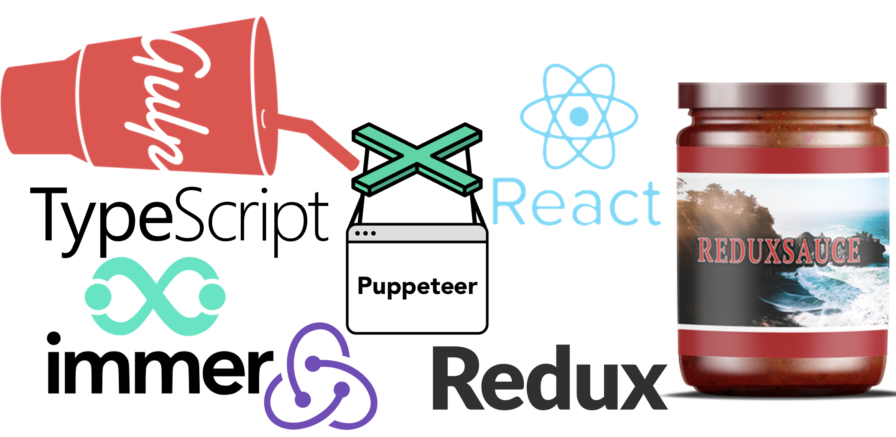

# Client

Client Project include all the code for the client side.
Client based `reeact` and `redux`.

## Client Folder Structure

          .
    |     ├── src     
    |           ├── actions     
    |               ├── redux
    |               ├── saga
    |               ├── index.ts
    |           ├── base
    |               ├── features
    |           ├── configurations
    |               ├── error.config.json
    |               ├── spinner.config.json
    |           ├── common-components
    |           ├── pages
    |           ├── public
    |               ├── assets
    |               ├── sass
    |               ├── index.ejs
    |           ├── requests
    |           ├── routes
    |           ├── translation
    |               ├── json
    |               ├── index.ts
    |           ├── config.ts
    |           ├── index.tsx

## Base Technologies

    
     

#### Syntax 

- <a href="https://www.typescriptlang.org/" target="_blank">typescript</a>

#### React

- <a href="https://facebook.github.io/react/" target="_blank">react</a>
- <a href="https://github.com/ReactTraining/react-router" target="_blank">react-router</a>

#### Redux

- <a href="http://redux.js.org/docs/introduction/" target="_blank">redux</a>
- <a href="https://github.com/redux-saga/redux-saga" target="_blank">redux-saga</a>
- <a href="https://github.com/jkeam/reduxsauce" target="_blank">redux-sauce</a>

- <a href="https://preview.npmjs.com/package/redux-flow-manager" target="_blank">redux-flow-manager</a>
- <a href="https://github.com/acdlite/redux-promise" target="_blank">redux-promise</a>
- <a href="http://redux-form.com/6.6.3/" target="_blank">redux-form</a>
- <a href="https://www.npmjs.com/package/redux-form-field" target="_blank">redux-form-field</a>

#### Websocket

- <a href="https://github.com/mehmetkose/react-websocket" target="_blank">react-websocket</a>
- <a href="https://www.npmjs.com/package/ws-reconnect-js" target="_blank">ws-reconnect-js</a>

#### Utils

- <a href="https://immerjs.github.io/immer/docs/introduction/" target="_blank">immer</a>
- <a href="https://github.com/mzabriskie/axios" target="_blank">axios</a>

#### Builds

- <a href="https://webpack.js.org/" target="_blank">webpack</a>
- <a href="https://poi.js.org/" target="_blank">Poi</a>
